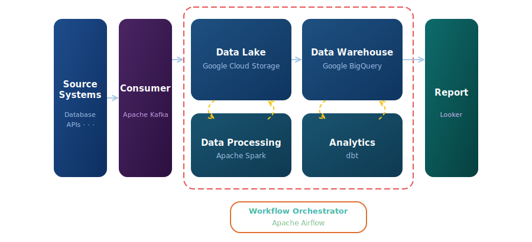
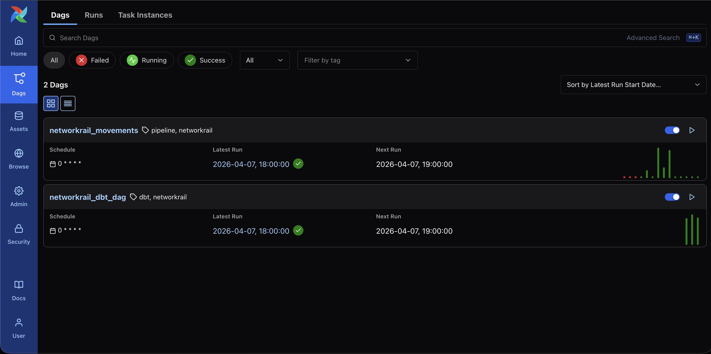
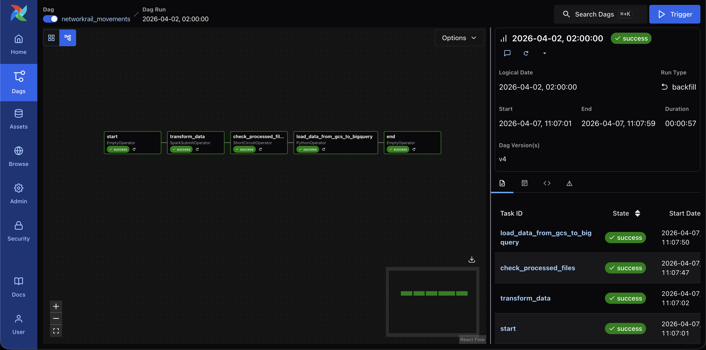
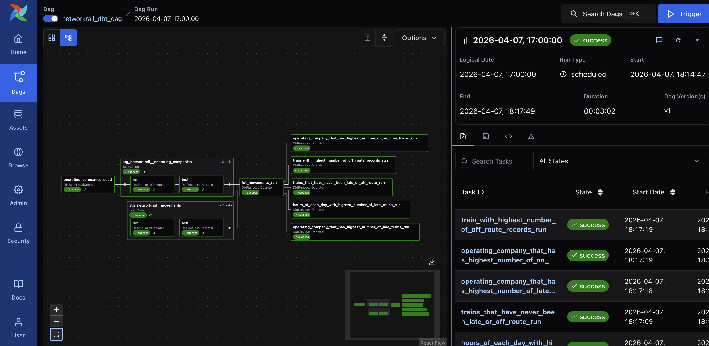
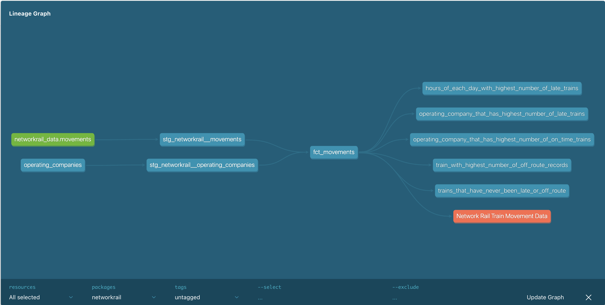
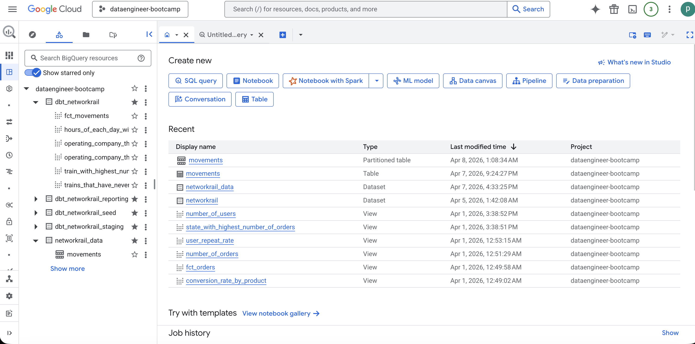
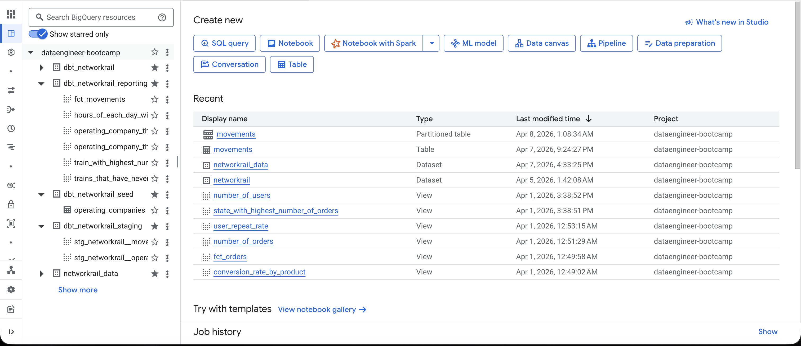
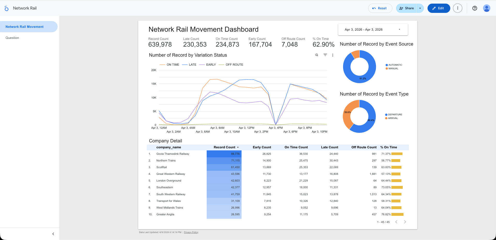
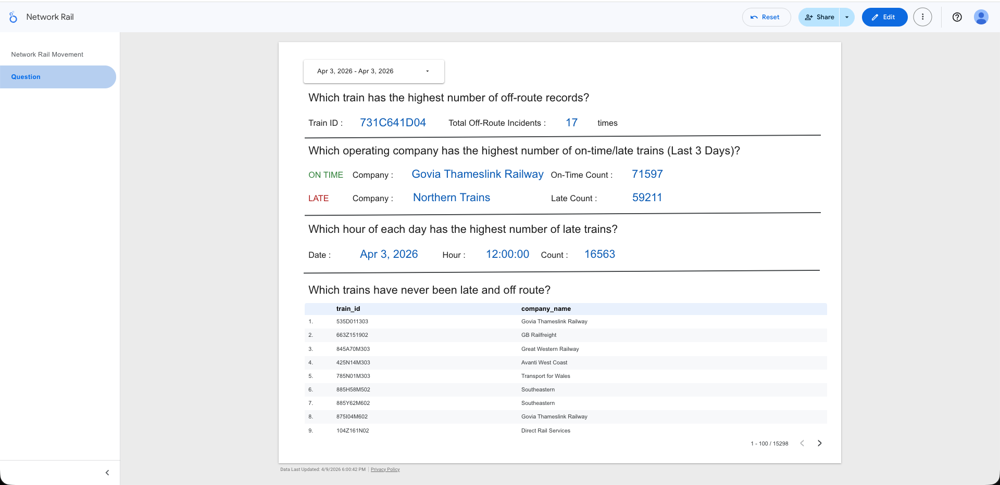

# Network Rail Realtime Analytics

Network Rail Realtime Analytics เป็น end-to-end streaming data pipeline ที่สร้างขึ้นจากข้อมูล real-time ของขบวนรถไฟในสหราชอาณาจักร (UK) โดยครอบคลุม lifecycle ของงาน Data Engineering ตั้งแต่ต้นจนจบ — ตั้งแต่การรับ event stream จาก Network Rail Open Data Feed ผ่าน Kafka, จัดเก็บ raw data ลง GCS, แปลงข้อมูลด้วย PySpark, load เข้า BigQuery ไปจนถึง dbt models ที่ตอบ business questions เกี่ยวกับความตรงต่อเวลาของรถไฟ

---

## Architecture



Pipeline ทำงานแบบ hourly โดยมี 2 DAG หลัก และ Kafka streaming layer ที่รันแยกต่างหาก:

1. **Produce** — Producer ดึง movement events จาก Network Rail Open Data Feed (STOMP protocol) แล้ว publish ลง Kafka topic `networkrail-train-movements`
2. **Consume & Store** — Consumer อ่าน messages จาก Kafka แล้ว batch upload ขึ้น GCS เป็น NDJSON (prefix: `networkrail/raw/`) โดย partition ตาม event timestamp
3. **Transform** — Airflow trigger PySpark job อ่าน raw NDJSON จาก GCS มา enforce schema แล้ว write กลับเป็น Parquet (prefix: `networkrail/processed/`)
4. **Load** — load Parquet จาก GCS เข้า BigQuery แบบ hourly-partitioned table
5. **Model** — `networkrail_dbt_dag` (ใช้ Astronomer Cosmos) รัน dbt models ทั้งหมด

> **Screenshot:** *(Airflow DAG grid view แสดง pipeline ทั้งหมด)*



> **Screenshot:** *(DAG graph view task flow: spark → check → BQ)*




---

## UK Timestamp Handling

ข้อมูลที่ได้รับจาก Network Rail Open Data Feed ส่งมาเป็น Unix timestamp (milliseconds) ใน pipeline นี้ **Producer จงใจแปลง timestamp ให้เป็น UK local time (Europe/London) ก่อน publish ลง Kafka** เพื่อจำลอง scenario จริงที่ระบบต้นทางส่งข้อมูลมาเป็น local timezone ของประเทศนั้น ๆ แทนที่จะเป็น UTC — ซึ่งเป็นเรื่องที่อาจพบได้ในระบบ legacy หรือ IoT sensors ที่ตั้งค่า timezone ตามพื้นที่ติดตั้ง timezone นี้ยังมีความซับซ้อนจาก BST (British Summer Time) ที่ offset เปลี่ยนตามฤดูกาล (+0 ในฤดูหนาว, +1 ในฤดูร้อน)

**ขั้นตอนการจัดการตลอด pipeline:**

| Layer | การจัดการ |
|---|---|
| **Producer** | แปลง Unix ms → `datetime` ด้วย `pytz` timezone `Europe/London` (รองรับ BST offset อัตโนมัติ) แล้ว publish เป็น ISO string พร้อม timezone offset เพื่อจำลองว่าข้อมูลต้นทางมาเป็น UK local time |
| **Consumer** | แปลง timestamp string ให้กลับมาเป็น UTC ก่อน partition ลง GCS เพื่อให้ `dt=` / `hour=` partition สอดคล้องกับ UTC |
| **PySpark** | ตั้ง `spark.sql.session.timeZone = UTC` เพื่อให้ Spark parse `TimestampType` เป็น UTC ตลอด |
| **BigQuery** | column `actual_timestamp` ถูก rename เป็น `actual_timestamp_utc` ใน staging layer เพื่อสื่อสารชัดเจนว่าเป็น UTC |

---

## dbt Layers

```
staging/        → rename columns (actual_timestamp → actual_timestamp_utc), cast types
marts/          → final models สำหรับตอบ business questions + fact table
```

mart layer สร้างมาเพื่อตอบคำถามเหล่านี้:

| Mart Model | Business Question |
|---|---|
| `train_with_highest_number_of_off_route_records` | Which train has the highest number of off route records? |
| `operating_company_that_has_highest_number_of_on_time_trains` | Which operating company has the highest number of on time trains in the last 3 days? |
| `operating_company_that_has_highest_number_of_late_trains` | Which operating company has the highest number of late trains in the last 3 days? |
| `trains_that_have_never_been_late_or_off_route` | Which trains have never been late and off route? |
| `hours_of_each_day_with_highest_number_of_late_trains` | Which hour of each day has the highest number of late trains? |
| `fct_movements` | Fact table แบบ denormalized (movements joined กับ operating company name) |

> **Screenshot:** *(dbt lineage graph ตั้งแต่ source → staging → marts)*



> **Screenshot:** *(BigQuery console แสดง dataset กับ tables ทั้งหมด)*




---

## Dashboard

Dashboard สร้างด้วย **Looker Studio** เชื่อมต่อโดยตรงกับ BigQuery dataset `dbt_networkrail` (reporting schema) — มี 2 หน้า

### หน้า 1 — Network Rail Movement (Overview)

ภาพรวมของ movement events ทั้งหมด ดึงจาก `fct_movements`

- KPI metrics: Record Count, Late Count, On Time Count, Early Count, Off Route Count, % On Time
- Time-series chart: Number of Record by Variation Status (ON TIME / LATE / EARLY / OFF ROUTE)
- Donut charts: Number of Record by Event Source (AUTOMATIC / MANUAL), Number of Record by Event Type (DEPARTURE / ARRIVAL)
- Company Detail table: record count, early/on-time/late/off-route breakdown, % on time per operating company



### หน้า 2 — Question (Business Questions)

ตอบ business questions โดยตรงจาก mart models

- **Which train has the highest number of off-route records?** → `train_with_highest_number_of_off_route_records`
- **Which operating company has the highest number of on-time/late trains (Last 3 Days)?** → `operating_company_that_has_highest_number_of_on_time_trains` / `operating_company_that_has_highest_number_of_late_trains`
- **Which hour of each day has the highest number of late trains?** → `hours_of_each_day_with_highest_number_of_late_trains`
- **Which trains have never been late and off route?** → `trains_that_have_never_been_late_or_off_route`



---

## Tech Stack

- **Orchestration** — Apache Airflow
- **Streaming** — Apache Kafka
- **Processing** — Apache Spark / PySpark
- **Transformation** — dbt Core + BigQuery adapter (Astronomer Cosmos)
- **Storage** — Google Cloud Storage, Google BigQuery
- **Source** — Network Rail Open Data Feed (STOMP over WebSocket)
- **Infra** — Docker Compose (Airflow + Spark cluster + Kafka)

---

## Project Structure

```
networkrail-realtime-analytics/
├── dags/
│   ├── networkrail_movements.py   # hourly pipeline: spark → check → BQ
│   └── networkrail_dbt_dag.py     # hourly dbt run via Astronomer Cosmos
├── dbt/networkrail/
│   └── models/
│       ├── staging/               # 2 staging models
│       └── marts/                 # 5 business metric models + fct_movements
├── networkrail_producer/          # STOMP consumer → Kafka producer
├── networkrail_consumer/          # Kafka consumer → GCS batch uploader
├── pyspark/                       # PySpark transformation job
├── docker/                        # Dockerfiles สำหรับ Airflow และ Spark
├── docker-compose.yml
├── docker-compose.kafka.yml
└── Makefile
```

---

## Local Setup

**ต้องมี:** Docker และ GCP Service Account ที่มีสิทธิ์ BigQuery + GCS

```bash
# start Airflow + Spark cluster
make build
make up

# start Kafka (แยก compose file)
make kafka-up
```

Airflow UI: `http://localhost:8080`

**ตั้งค่า Airflow Connections** (Admin → Connections):

| Conn ID | Type | รายละเอียด |
|---|---|---|
| `my_spark` | Spark | Host: `spark://spark-master`, Port: `7077` |
| `load_data_to_gcs` | Google Cloud Platform | Project ID: `<your_project_id>`, Keyfile JSON: `<your_service_account_json>` |
| `load_data_to_bigquery` | Google Cloud Platform | Project ID: `<your_project_id>`, Keyfile JSON: `<your_service_account_json>` |

**Run Producer & Consumer** (ต้องมี Network Rail API credentials):

```bash
# Producer — subscribe Network Rail feed แล้ว publish ลง Kafka
cd networkrail_producer
python get_networkrail_movements.py

# Consumer — อ่านจาก Kafka แล้ว batch upload ขึ้น GCS
cd networkrail_consumer
python consumer.py
```

**Trigger DAGs :**

1. `networkrail_movements` — รัน hourly: spark transform → check → load to BQ
2. `networkrail_dbt_dag` — รัน hourly: dbt models ทั้งหมดบน BigQuery

```bash
# รัน dbt แยก (ต้องมี BigQuery credentials)
cd dbt/networkrail
dbt run
dbt test
```

```bash
# shortcut ต่าง ๆ ของ Spark (ผ่าน Makefile)
make bash        # เข้า shell ใน spark-master
make pyspark     # เปิด PySpark REPL
make notebook    # Jupyter notebook ที่ port 3000
```
